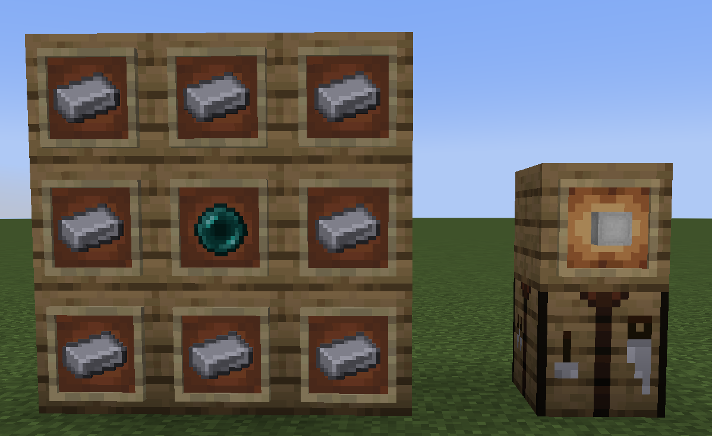
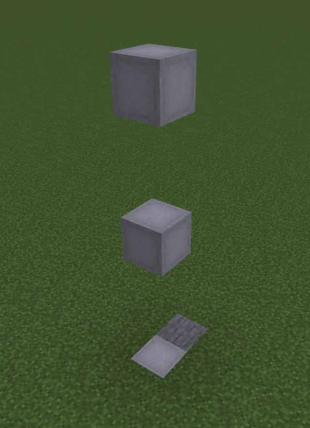

# Simplest Fabric Elevator

## Setup

Install this mod using [Modrinth's app](https://modrinth.com/app) or [AT Launcher](https://atlauncher.com/)

## Usage

You can craft the Elevator Block using this recipe : 

Place them with at least 2 blocks of space between them, vertically. 

Like so :

You can press "Jump" to go UP, "Crouch" to go DOWN. Enjoy 🙂

## License

Check the [license file ](./LICENSE.md)